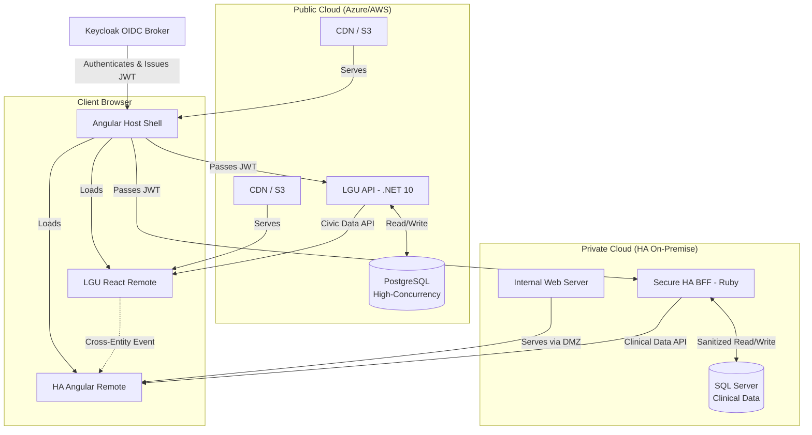

# System Architecture

## Cloud-Hybrid Topology

```mermaid
graph TD
    subgraph "Client Browser"
        Shell[Angular Host Shell]
        Shell -->|Loads| LGU_MFE[LGU React Remote]
        Shell -->|Loads| HA_MFE[HA Angular Remote]
    end

    IdP[Keycloak OIDC Broker] -->|Authenticates & Issues JWT| Shell

    subgraph "Public Cloud (Azure/AWS)"
        LGU_CDN[CDN / S3] -->|Serves| LGU_MFE
        Shell_CDN[CDN / S3] -->|Serves| Shell
        LGU_API[LGU API - .NET 10] -->|Civic Data API| LGU_MFE
        Civic_DB[(PostgreSQL\nHigh-Concurrency)]
        LGU_API <-->|Read/Write| Civic_DB
    end

    subgraph "Private Cloud (HA On-Premise)"
        HA_Server[Internal Web Server] -->|Serves via DMZ| HA_MFE
        HA_Proxy[Secure HA BFF - Ruby] -->|Clinical Data API| HA_MFE
        HA_DB[(SQL Server\nClinical Data)]
        HA_Proxy <-->|Sanitized Read/Write| HA_DB
    end
    
    LGU_MFE -.->|Cross-Entity Event| HA_MFE
    Shell -->|Passes JWT| LGU_API
    Shell -->|Passes JWT| HA_Proxy
```